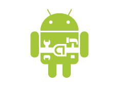

andhelp
=======

The Goal of AndHelp is to reduce the amount of those *Util classes while you're developing your android App. 

Most classes are designed to be best used as static import

IO related:
-----------

Package org.andhelp.io.*

UI related:
-----------

org.andhelp.ui.*

Database related:
-----------------

org.andhelp.db.*

Collection related:
-----------------

org.andhelp.collection.*

